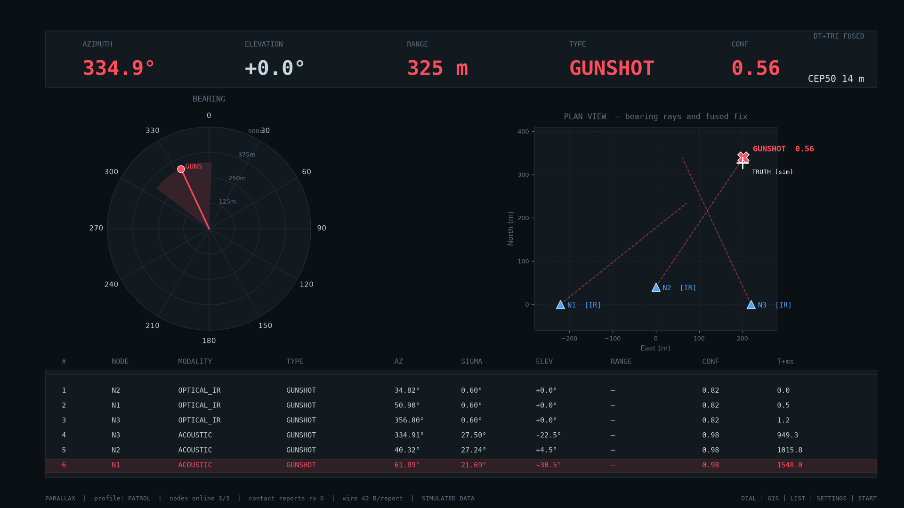

# PARALLAX

**A distributed passive-sensor network that turns scattered detections from many cheap nodes into one continuously updated threat picture.**

Named for the geometric principle it runs on: two separated observers looking at the same distant object determine its position from the difference in their lines of sight. That's the whole system in one word.

Built for a college hackathon selecting from the SIH 2024 problem statement list. The base problem statement — *microphone-array direction-of-arrival estimation for gunshot detection* — is one of 246 listed statements and will be pitched by multiple teams from an identical spec. This project keeps that acoustic work intact as the flagship, working module, and demotes it to one of four sensing modalities inside a larger multi-modal fusion platform, because the defensible engineering is in the fusion layer, not in re-deriving a block diagram everyone else has too.

**This is a software prototype. No hardware was built. No field recordings were made.** Every waveform is a physically-motivated synthetic model; every accuracy number is either derived from stated physics or explicitly marked `ESTIMATE`. See [docs/04-limitations.md](docs/04-limitations.md) before quoting any figure from this repository.

---

## What's actually here

A runnable, tested, end-to-end simulation of the whole pipeline — not a design document with no code behind it:

- **`parallax/`** — the library. Geometry, direction-of-arrival (GCC-PHAT), feature extraction, a gradient-boosted-tree classifier, the wire-format contact report, and the fusion engine that turns many reports into tracked, ranged, confidence-scored threats.
- **`sim/`** — the simulation harness. Physically-modelled synthetic gunshot audio (Friedlander blast wave, spherical spreading, atmospheric absorption, additive noise, optional multipath), a synthetic classifier-training corpus, and an end-to-end demo script.
- **`viz/`** — the C2 dashboard renderer. Consumes structured track data and knows nothing about signals — the algorithm and the display are two separately testable, separately swappable pieces, by design.
- **`tests/`** — 32 unit tests, including several that assert the system *refuses* to produce a number when the physics doesn't support one.
- **`docs/`** — the full design write-up: architecture, fusion logic, the ML component, honest limitations, the 7-slide pitch, and the six hardest anticipated judge questions with direct answers.

## Sample output



A 3-node patrol scenario: a synthetic shot at 350 m fuses optical (flash) and acoustic bearings from three nodes into one tracked, ranged, ALERT-classified contact — 12.4 m position error, 1.3–24.6 m range error depending on method, against a fully simulated ground truth. The dial's shaded wedge is the 1σ bearing uncertainty, drawn honestly rather than hidden. See [docs/02-fusion-logic.md](docs/02-fusion-logic.md) for what produced every number on this screen.

---

## Quickstart

```bash
git clone <this-repo>
cd parallax
python -m pip install -r requirements.txt

# run the test suite (32 tests, <1s)
python -m pytest tests -q

# train the transient classifier on a SYNTHETIC corpus (~1 min)
python -m sim.train_classifier

# run the end-to-end demo: synthetic shot -> edge processing -> fusion -> JSON
python -m sim.run_demo --profile patrol --range 350 --bearing 35

# render the C2 dashboard from the demo's output
python -m viz.radar out/tracks.json --save out/dashboard.png
```

### Try the failure modes on purpose

```bash
# urban multipath: watch two of three nodes self-flag and degrade to bearing-only
python -m sim.run_demo --profile urban --multipath --range 300 --bearing 60

# a lone patrol node with no optical channel: bearing only, no range fabricated
python -m sim.run_demo --profile patrol --no-optical --nodes 1 --range 380 --bearing 10
```

Every run prints ground truth alongside the estimate, so the error is visible rather than asserted.

---

## Why this design, in one paragraph per decision

- **One node, one fusion engine, four mission profiles** (perimeter / convoy / patrol / urban) — a profile changes sensor weighting and alert thresholds, never the hardware or the code path. See [docs/01-architecture.md](docs/01-architecture.md).
- **A raised sixth microphone**, not a flat hexagonal ring — the problem statement doesn't specify geometry, and a planar array *cannot observe elevation at all*. Same six mics, same cost; the code refuses to report elevation from a planar array (`tests/test_doa.py::test_planar_array_refuses_to_report_elevation`).
- **Broadband GCC-PHAT, not narrowband beamforming** — this is what justifies a 30 cm aperture at 3 kHz without violating spatial-aliasing limits, and it's the sharpest technical objection a judge is likely to raise. Answered in [docs/06-judge-questions.md](docs/06-judge-questions.md#3-why-is-your-microphone-aperture-30-cm-when-the-spatial-aliasing-limit-at-3-khz-is-57-cm).
- **An optical/IR muzzle-flash channel** is the highest-value addition available: it turns a single node into a *ranged* fix (`R = c·Δt`), works when a suppressor kills the acoustic crack, and is the reason a lone patrol node isn't limited to a bearing.
- **The fusion layer never fabricates a number it can't support** — no range from acoustic amplitude, no position from two nodes with a shallow crossing angle, no silent averaging when two ranging methods disagree. It says what it doesn't know. See [docs/02-fusion-logic.md](docs/02-fusion-logic.md).
- **The localisation algorithm and the dashboard are two separate modules** connected only by a JSON contract (`sim/run_demo.py` writes it, `viz/radar.py` reads it) — the algorithm is testable headlessly, and the display can be re-skinned for a wrist unit or an HQ wall without touching anything that computes a bearing.

## Documentation

| Doc | Covers |
|---|---|
| [docs/01-architecture.md](docs/01-architecture.md) | Sensor / edge / fusion / C2 layers, concretely |
| [docs/02-fusion-logic.md](docs/02-fusion-logic.md) | Time sync, event association, ranging, confidence scoring, conflict resolution — the technical core |
| [docs/03-ml-classifier.md](docs/03-ml-classifier.md) | What's classified, the feature set, training data reality, failure modes |
| [docs/04-limitations.md](docs/04-limitations.md) | What this system does not do, with every number sourced |
| [docs/05-pitch-deck.md](docs/05-pitch-deck.md) | The 7-slide breakdown |
| [docs/06-judge-questions.md](docs/06-judge-questions.md) | The six hardest anticipated questions, answered directly |

## Repository layout

```
parallax/            core library
  geometry.py           ENU projection, triangulation, error ellipses
  doa.py                array geometry, GCC-PHAT, plane-wave bearing solve
  features.py            24-feature extraction for classification
  classifier.py          calibrated gradient-boosted-tree classifier
  contact.py              42-byte wire contact report, wire (de)serialisation
  fusion.py                association, ranging, confidence scoring
  profiles.py               the four mission profiles
sim/                  simulation harness (nothing here runs on real hardware)
  scenario.py            synthetic acoustic scene renderer
  edge_node.py            simulated FPGA/MCU edge pipeline
  train_classifier.py     synthetic training corpus + training script
  run_demo.py              end-to-end demo: shot -> reports -> fused tracks
viz/                  presentation layer
  radar.py                C2 dashboard renderer (JSON in, PNG out)
tests/                32 unit tests
docs/                 architecture, fusion logic, ML notes, limitations, pitch, Q&A
```

## Running the tests

```bash
python -m pytest tests -q
```

32 tests, covering (among other things): the DoA solver's sign convention, elevation observability on planar vs. non-planar arrays, the wire format's 42-byte size and CRC, the ~20,600:1 bandwidth argument for edge classification, association-window scaling with node baseline, and multiple cases where the fusion engine is required to *refuse* to emit a range or position rather than guess.

## License

MIT — see [LICENSE](LICENSE).
